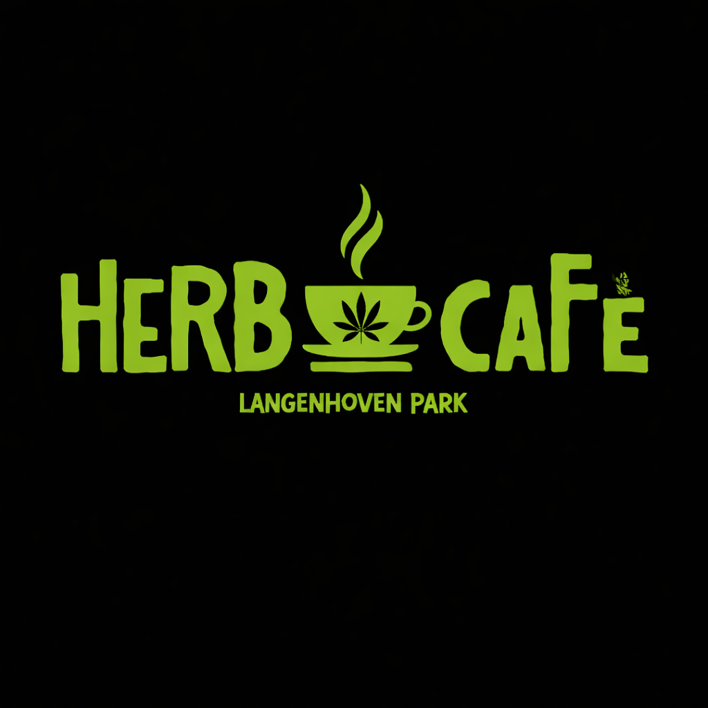

# Herb Café Website

Premium cannabis café website built with Vite, Tailwind CSS, and GSAP.



## 🌿 About

Herb Café is Langenhoven Park's premier cannabis-friendly café, offering premium cannabis products, artisan food, craft drinks, and vibrant culture.

## 🚀 Quick Start

```bash
# Install dependencies
npm install

# Start development server
npm run dev

# Build for production
npm run build

# Preview production build
npm run preview
```

## 📁 Project Structure

```
herb-cafe/
├── public/
│   ├── animations/         # Lottie animation files
│   ├── images/
│   │   ├── logo/          # Logo files
│   │   ├── gallery/       # Gallery images (PLACEHOLDER)
│   │   ├── partners/      # Partner logos (PLACEHOLDER)
│   │   └── menu/          # Menu item images (PLACEHOLDER)
│   └── videos/            # Video files (PLACEHOLDER)
│
├── src/
│   ├── css/
│   │   ├── main.css       # Tailwind imports + base styles
│   │   ├── animations.css # Keyframe animations
│   │   └── components.css # Component styles
│   │
│   ├── js/
│   │   ├── main.js        # Entry point
│   │   ├── loader.js      # Loading animation
│   │   ├── age-gate.js    # Age verification
│   │   ├── navigation.js  # Mobile menu
│   │   ├── carousel.js    # Partner carousel
│   │   ├── gallery.js     # Gallery + lightbox
│   │   ├── scroll-animations.js  # GSAP animations
│   │   └── whatsapp.js    # WhatsApp button
│   │
│   ├── data/
│   │   ├── menu.json      # Food & drinks
│   │   ├── products.json  # Cannabis products
│   │   ├── partners.json  # Partner suppliers
│   │   └── gallery.json   # Gallery metadata
│   │
│   └── *.html             # Page files
│
├── tailwind.config.js
├── vite.config.js
└── netlify.toml
```

## 🎨 Brand Colors

| Color | Hex | Usage |
|-------|-----|-------|
| Herb Green | `#A4D65E` | Primary accent, CTAs |
| Dark | `#1a1a1a` | Background |
| Gray | `#2D2D2D` | Cards, sections |
| Gold | `#FFD700` | Premium accents |

## ✏️ Content Updates

### Menu Items
Edit `src/data/menu.json`:
```json
{
  "name": "Herb Burger",
  "description": "Gourmet beef patty...",
  "price": "R95",
  "image": "/images/menu/burger.jpg"
}
```

### Products
Edit `src/data/products.json` with similar structure.

### Gallery
1. Add images to `public/images/gallery/`
2. Update `src/data/gallery.json`

### Partners
1. Add logos to `public/images/partners/`
2. Update `src/data/partners.json`

## 🔧 Replace Placeholders

Search and replace these placeholders:

| Placeholder | Description |
|-------------|-------------|
| `27XXXXXXXXX` | WhatsApp phone number |
| `123 Example Street` | Actual address |
| `+27 XX XXX XXXX` | Phone number |
| Google Maps iframe | Actual coordinates |

## 📱 Responsive Breakpoints

- Mobile: < 640px
- Tablet: 640px - 1024px  
- Desktop: > 1024px

## 🌐 Deployment

### Netlify (Recommended)
1. Connect GitHub repo to Netlify
2. Build command: `npm run build`
3. Publish directory: `dist`

### Manual
```bash
npm run build
# Upload dist/ folder to hosting
```

## 📦 Tech Stack

- **Build**: Vite 5.x
- **Styling**: Tailwind CSS 3.x
- **Animations**: GSAP 3.x
- **Carousel**: Splide.js 4.x
- **Lightbox**: GLightbox 3.x
- **Loading**: Lottie Web 5.x

## 📄 License

© 2024 Herb Café. All rights reserved.
